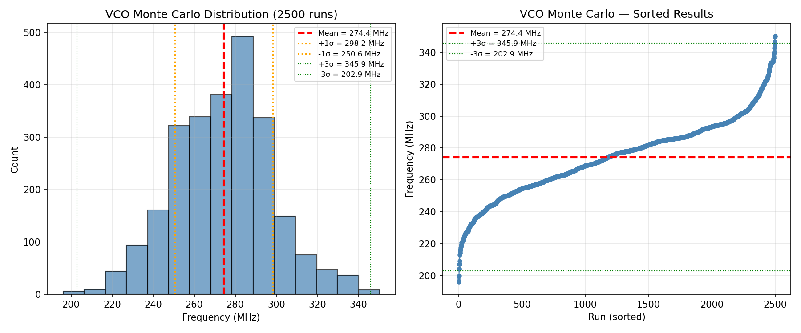
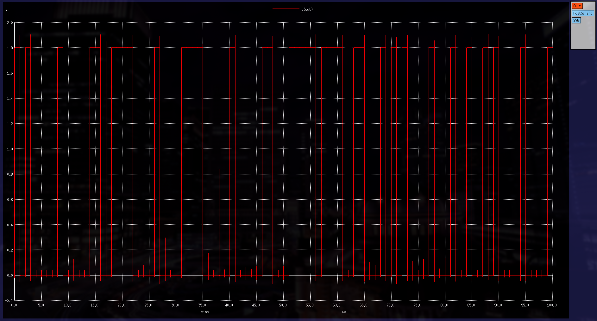

# 8-Oscillator True Random Number Generator
## in SKY130A for Quantum-Safe Optical Communications

**Rakha Naufal | Tiny Tapeout | SKY130A | 1x2 Analog Tile**

---

## 1. Overview

This design implements a True Random Number Generator (TRNG) using eight current-starved ring oscillators whose outputs are combined through a chain of seven XOR gates and sampled by a TSPC D flip-flop. Thermal noise and process variation cause each ring oscillator to run at a slightly different frequency, creating phase jitter that accumulates over time into genuine entropy. The sampled output is a non-deterministic bitstream suitable for cryptographic key generation and secure optical communications applications.

---

## 2. Architecture

| Block | Count | Description |
|---|---|---|
| Current-Starved Ring VCO | 8x | 5-stage ring oscillator, intentionally mismatched sizing |
| Output Buffer | 8x | 4-stage inverter chain, squares up VCO output |
| CMOS XOR Gate | 7x | Full custom 8-transistor static CMOS XOR |
| TSPC D Flip-Flop | 1x | 11-transistor true single-phase clock DFF |

**Signal flow:**
```
VCO1-8 → 8x Buffer → XOR chain (7 stages) → TSPC DFF → FOUT
```

---

## 3. Pin Assignment

| Analog Pin | Signal | Direction | Description |
|---|---|---|---|
| UA[0] | VCTRL | Input | VCO control voltage (nominal 1.2V) |
| UA[1] | XORCHAIN | Output | Raw XOR chain output (debug) |
| UA[2] | FOUT | Output | Sampled random bit output |
| UA[3] | CLK | Input | Sampling clock (recommended 1 MHz) |

---

## 4. Key Specifications

| Parameter | Value | Condition |
|---|---|---|
| Technology | SKY130A 1.8V | — |
| Supply Voltage | 1.8V | — |
| VCO Control Voltage | 1.2V (nominal) | — |
| Nominal VCO Frequency | 278 MHz | TT / 27°C |
| KVCO | ~1 GHz/V | At operating point |
| Tuning Range | 0 – 630 MHz | VCTRL: 0 – 1.8V |
| Power Consumption | 157 µW | TT / 27°C / VCTRL=1.2V |
| Recommended Sampling Rate | 1 MHz | — |
| Random Bit Output Rate | 1 Mbit/s | At 1 MHz CLK |
| Tile Size | 1x2 Tiny Tapeout Analog | ~160 x 225 µm |

---

## 5. PVT Corner Analysis

VCO frequency measured at VCTRL = 1.2V across all corners:

| Corner | Temperature | Period (ns) | Frequency (MHz) |
|---|---|---|---|
| TT (Typical) | 27°C | 3.60 | 278 |
| FF (Fast-Fast) | 27°C | 2.49 | 402 |
| SS (Slow-Slow) | 27°C | 6.49 | 154 |
| TT (Typical) | 85°C | 3.97 | 252 |
| FF (Fast-Fast) | -40°C | 2.51 | 398 |
| SS (Slow-Slow) | 85°C | 6.59 | 152 |

The VCO operates across a 2.6x frequency range from worst-case slow (152 MHz) to worst-case fast (402 MHz). The TRNG remains functional across all corners as long as CLK_SAMPLE is set well below the VCO frequency.

---

## 6. Monte Carlo Analysis

2500 Monte Carlo runs at TT corner, 27°C, VCTRL = 1.2V using SKY130A `tt_mm` mismatch models:

| Parameter | Value |
|---|---|
| Number of runs | 2500 |
| Mean frequency | 274.39 MHz |
| Standard deviation | 23.83 MHz |
| Minimum | 196.12 MHz |
| Maximum | 350.32 MHz |
| 3σ range | 202.91 – 345.88 MHz |
| 3σ variation | ±26.1% |


The ±26.1% frequency variation across 2500 runs is typical for current-starved ring oscillators in 130nm and confirms that process mismatch between VCO instances will naturally generate entropy without additional tuning.

---

## 7. Simulation Results

### 7.1 Pre-Layout Functional Simulation

The TRNG was verified at TT/27°C with VCTRL = 1.2V and CLK = 1 MHz. FOUT shows a clean random bitstream switching between 0V and 1.8V at the sampling clock rate with no visible periodicity.

Key observations:
- Rail-to-rail output (0V / 1.8V) confirmed
- Random switching pattern with no visible periodicity
- Clean edges at CLK rising edges
- No metastability observed at 1 MHz sampling rate



---

## 8. Testing After Tapeout

| Step | Action | Expected Result |
|---|---|---|
| 1 | Apply 1.2V DC to UA[0] (VCTRL) | VCOs begin oscillating |
| 2 | Apply 1 MHz square wave to UA[3] (CLK) | DFF begins sampling |
| 3 | Read UA[2] (FOUT) with oscilloscope or logic analyser | Random bit sequence visible |
| 4 | Collect 1 million bits at 1 Mbit/s | Takes ~1 second |
| 5 | Run NIST SP800-22 statistical test suite | Expect pass on all 15 tests |

---

## 9. Photonics & Security Application

True random number generation is a critical primitive in quantum-safe optical communications. Specific applications include:

- **Quantum Key Distribution (QKD):** Random basis selection and key sifting
- **Optical encryption:** Session key generation for WDM channel encryption
- **LiDAR anti-spoofing:** Random pulse timing to prevent replay attacks
- **Secure coherent optical links:** Nonce generation for authenticated protocols

The use of multiple ring oscillators exploits the inherent unpredictability of thermal noise in CMOS — the same noise source that limits phase noise in optical clock recovery circuits — making this TRNG directly relevant to photonic integrated circuit security.

---

## 10. Design Summary

| Metric | Result |
|---|---|
| Total custom transistors | ~300 (fully custom, no standard cells) |
| VCO count | 8 |
| XOR gates | 7 (full custom CMOS) |
| DFF | 1 (TSPC topology) |
| Nominal output frequency | 278 MHz (TT/27°C) |
| Power | 157 µW |
| DRC status | Clean (0 errors) |
| Tiny Tapeout precheck | All checks passed ✅ |
| Pre-layout simulation | Functional TRNG output verified at 1 MHz |
